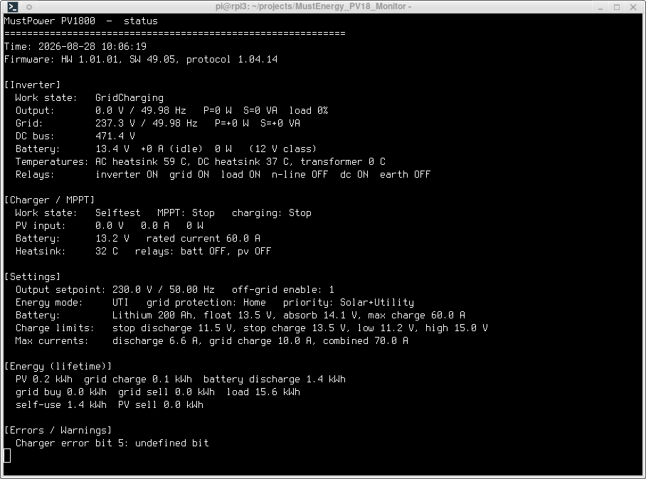
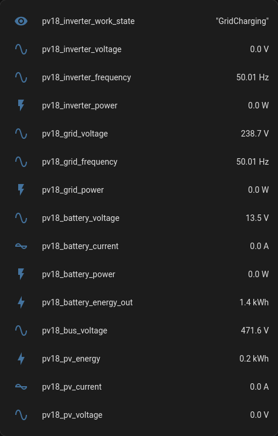

# MustEnergy PV18 Monitor

### Names

- official name: PV18-1512VPM
- device type: Sp1800
- protocol family: Ph18Series
- pata model: Ph1800M

### Usage

#### command line

`python3 src/py/pv18_monitor.py --watch --mqtt-host 192.168.1.10`

#### screenshot

##### terminal

##### Home Assistant integration

